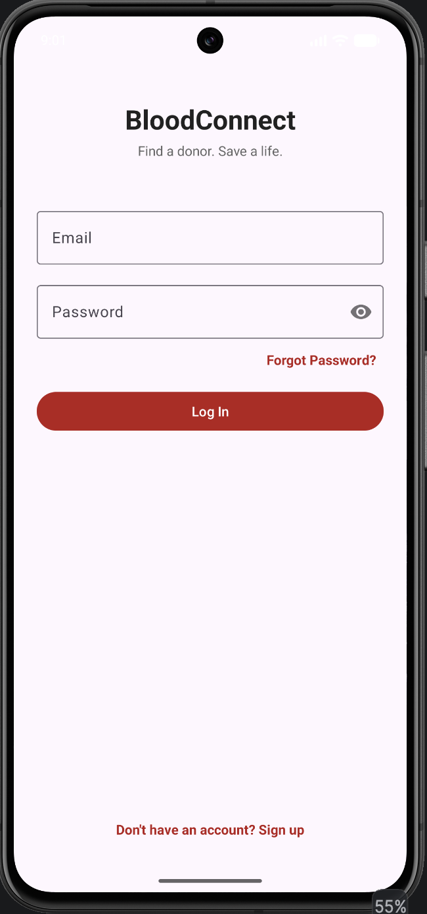
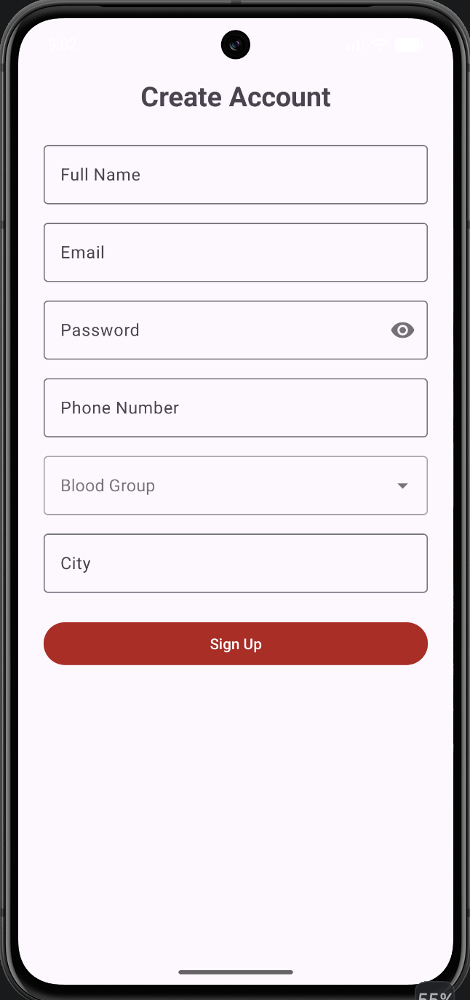
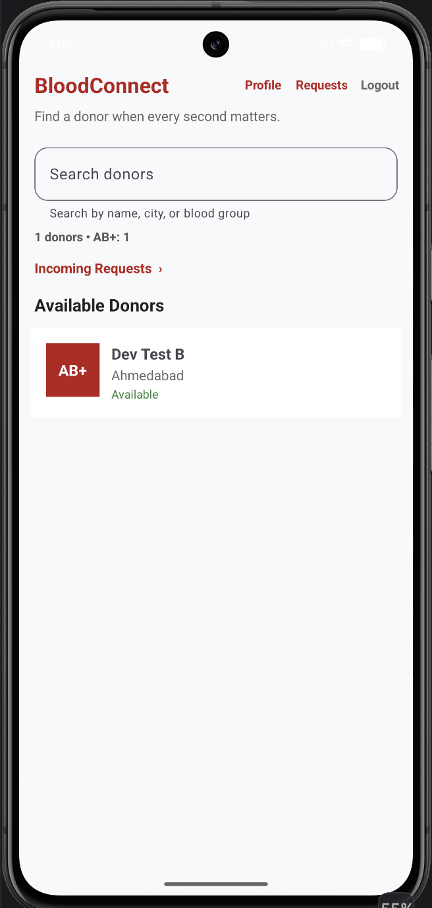
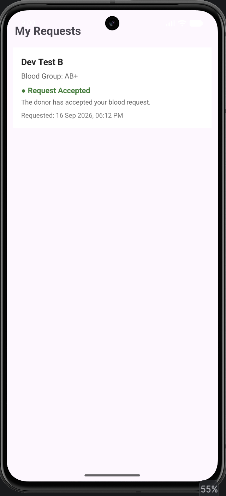
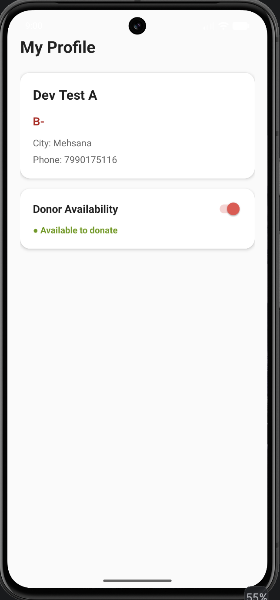

# BloodConnect 🩸

A mobile app that connects blood donors with people in need — in real time, across devices.

## Objective

Built for the **Mobile Application Development** course (2CEIT5PE18) at Ganpat University.
BloodConnect solves a real civic problem: finding an available, nearby blood donor
quickly during an emergency, using live cloud data instead of static directories or
phone-book searching.

## Features

- ✅ Email/password signup & login (Firebase Authentication)
- ✅ Donor profile creation (name, blood group, phone, city)
- ✅ Real-time donor list with live search & filter (by blood group, city, or name)
- ✅ Dashboard stats — total donor count and breakdown by blood group
- ✅ Donor Detail view with full contact info
- ✅ Send blood requests to donors, with duplicate-request prevention
- ✅ "My Requests" screen to track sent requests and their status
- ✅ "My Profile" screen — edit availability with a 90-day donation-safety rule
- ✅ Logout

## Tech Stack

- **Kotlin**
- **Android Views** — ConstraintLayout, RecyclerView, Material Components
- **Firebase Authentication** — email/password login
- **Firebase Firestore** — real-time cloud database (live sync across devices)
- **Kotlin Coroutines** — async Firebase calls

## Architecture

```
app/src/main/java/com/dev/bloodconnect/
 ├─ data/          # Data models (User.kt, Request.kt)
 ├─ repository/    # Firebase Auth + Firestore wrapper classes
 │   ├─ AuthRepository.kt
 │   ├─ DonorRepository.kt
 │   └─ RequestRepository.kt
 └─ ui/            # Activities & Adapters
     ├─ LoginActivity.kt
     ├─ SignUpActivity.kt
     ├─ DashboardActivity.kt
     ├─ DonorDetailActivity.kt
     ├─ MyRequestsActivity.kt
     ├─ ProfileActivity.kt
     ├─ DonorAdapter.kt
     └─ RequestAdapter.kt
```

**Firestore data model:**
```
users/{uid}
 ├─ name, phone, bloodGroup, city
 ├─ isAvailable: Boolean
 └─ lastDonationDate, createdAt

requests/{requestId}
 ├─ requesterId, requesterName
 ├─ donorId, donorName, bloodGroup
 ├─ status: "pending" | "accepted" | "declined"
 └─ createdAt
```

## Screenshots

| Login | Sign Up | Dashboard |
|---|---|---|
|  |  |  |

| My Requests | My Profile |
|---|---|
|  |  |

## Setup Instructions

1. Clone this repo
2. Open in Android Studio (Kotlin, min SDK 24)
3. Create your own Firebase project at [console.firebase.google.com](https://console.firebase.google.com)
4. Enable **Authentication → Email/Password** and **Firestore Database**
5. Download `google-services.json` from your Firebase project and place it in the `app/` folder
6. Sync Gradle and run

## Progress Log

| Day | Update |
|---|---|
| Day 1 | Project setup, repo initialized on GitHub |
| Day 2 | User model, AuthRepository, Login screen UI + logic |
| Day 3 | Sign Up screen, Dashboard placeholder, navigation wired up |
| Day 4 | Real-time Dashboard with RecyclerView, live search & filter |
| Day 5 | Donor Detail screen, Request system, My Requests screen |
| Day 6 | My Profile (availability toggle), Dashboard stats, duplicate-request prevention, app theming |

## Challenges Faced

- **Firestore data model design** — deciding between embedding requests inside donor
  documents vs. a separate `requests` collection. Went with a separate collection since
  it scales better and keeps donor documents lightweight.
- **Real-time listeners and lifecycle management** — had to make sure Firestore
  snapshot listeners were removed in `onDestroy()` to avoid memory leaks and
  unnecessary reads once a screen closes.
- **ConstraintLayout chaining bugs** — a missing `layout_constraintStart_toEndOf`
  on one header button caused all three header links (Profile/Requests/Logout) to
  become effectively untappable, since their positions were ambiguous. Fixed by
  explicitly chaining each view's start constraint to the previous view's end.
- **Firestore serialization quirks** — Firestore's automatic object mapper tried to
  serialize a computed Kotlin function (`isActuallyAvailable()`) as if it were a
  field, due to Kotlin's `is`-prefixed boolean naming convention. Resolved with
  the `@Exclude` annotation.
- **Duplicate blood requests** — added a check to prevent sending multiple pending
  requests to the same donor.

## Future Work

- Push notifications for new donor requests
- Map view showing nearby donors
- Ability for donors to accept/decline incoming requests (currently requests are
  visible but not actionable by the donor)
- SOS emergency broadcast to all matching donors in a city
- Custom app icon and dark-mode theme support

---

<p align="center">Made with ❤️ and passion by <b>Dev Patel</b></p>
